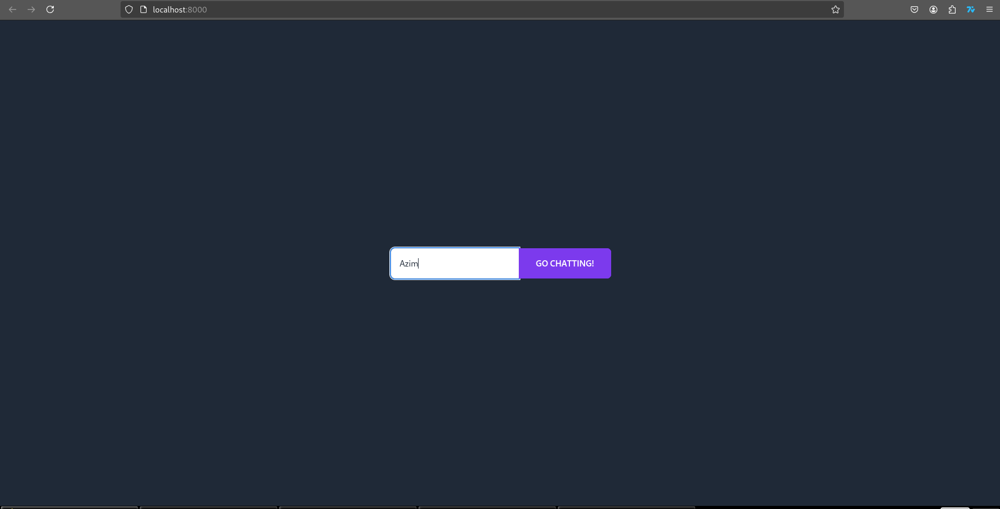
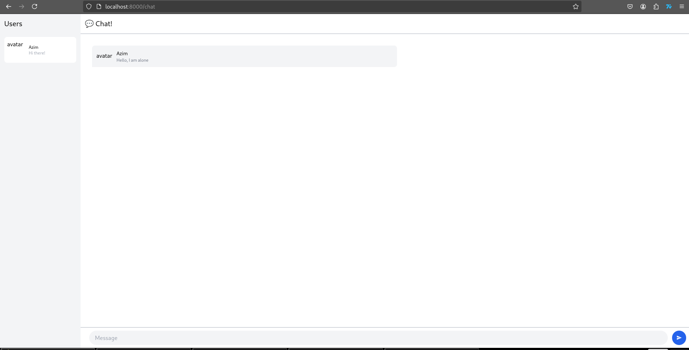
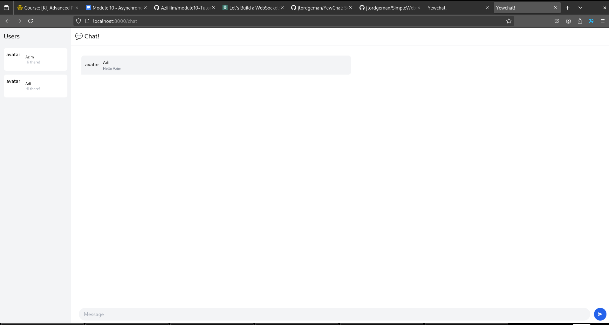
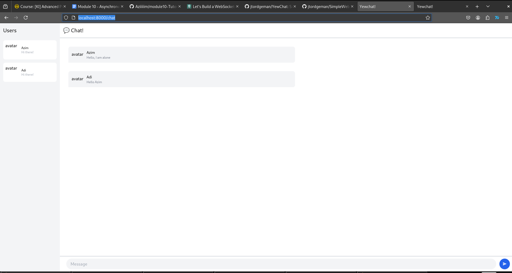
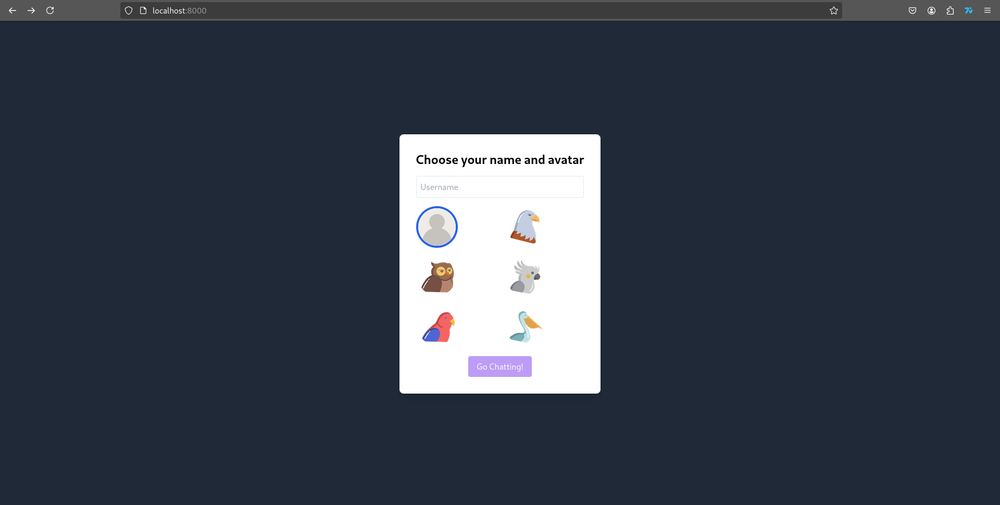
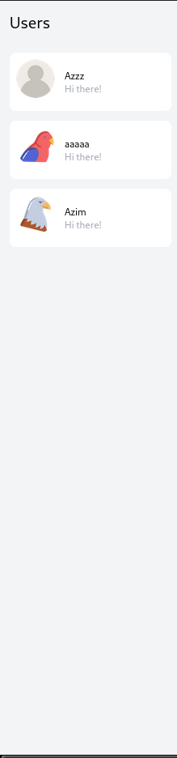
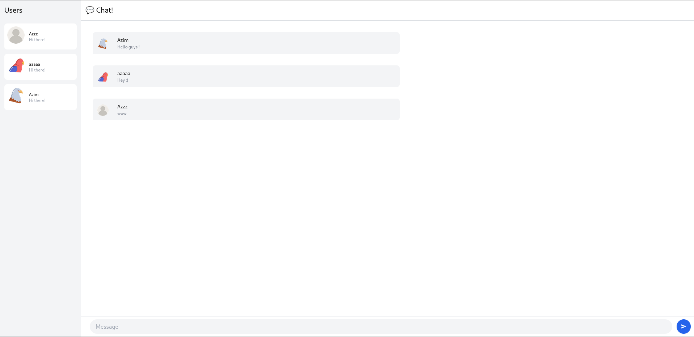

# Reflection

## 3.1. Original code

This is a test run of the Yew WebChat client based on the tutorial.

- Step 1 :

I open a new web window, login as 'Azim', and click “Go Chatting!”.
I join the chat alone:

- Step 2 :

I open a new web window, login as 'Adi', and click “Go Chatting!”.
I join the chat with Azim but I can't see the previous message from Azim because I was not in the chat session yet.
Azim session sees the new user:

Adi's window:

Azim's window:

## 3.2. Add some creativities to the webclient

### 1st feature : Add User Icon

I added the ability for users to choose a custom avatar when they join the chat. Instead of using generic randomly generated icons, users can now select from a list of bird icons during login:

Once connected, each user's avatar is shown:
- In the user list (left sidebar):

- Next to each of their messages in the chat window:

To do this:

- I modified the login page to let users choose an avatar (from 6 bird icons).

- I updated the WebSocket messages so that each user sends not only their name, but also their chosen avatar.

- The server then broadcasts both name and avatar to all clients.

- The client UI was updated to display avatars in the chat and user list.